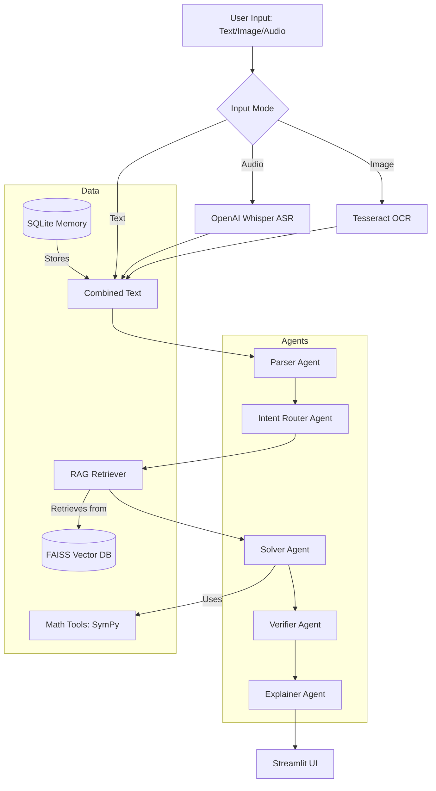

# Reliable Multimodal Math Mentor

A production-style AI application that solves JEE-level math problems using a multimodal RAG + Multi-Agent architecture.

## 🚀 Features

- **Multimodal Input**: Accept problems via **Image (OCR)**, **Audio (ASR)**, or Direct Text.
- **LangGraph Orchestration**: Robust multi-agent workflow (Parser, Router, Solver, Verifier, Explainer).
- **RAG Integration**: Retrieves relevant JEE math formulas from a curated FAISS database.
- **Explicit Math Tools**: Uses SymPy for symbolic logic and numerical evaluators (no hallucinations).
- **Memory Layer**: Learns from corrections and stores past problems in SQLite.
- **Human-in-the-Loop (HITL)**: Triggers manual review for low-confidence extractions or ambiguous parsing.

## 🏗️ Architecture



## 🛠️ Setup Instructions

### 1. Prerequisites
- Python 3.9+
- [Tesseract OCR](https://github.com/UB-Mannheim/tesseract/wiki) installed on your system.
- [FFmpeg](https://ffmpeg.org/download.html) installed on your system (for audio processing).

### 2. Installation
```bash
git clone <repo-url>
cd math-mentor-ai
pip install -r requirements.txt
```

### 3. Environment Configuration
Copy `.env.example` to `.env` and add your API keys:
```bash
cp .env.example .env
```
Ensure `TESSERACT_PATH` is set correctly for your OS.

### 4. Ingest Knowledge Base
Run the ingestion script or click the **Ingest Knowledge Base** button in the Streamlit UI:
```bash
python -m app.rag.ingest
```

### 5. Run the Application
```bash
streamlit run ui/streamlit_app.py
```

## 📂 Project Structure
```text
math-mentor-ai/
├── app/
│   ├── agents/          # Agent definitions (Parser, Solver, etc.)
│   ├── graph/           # LangGraph orchestration
│   ├── tools/           # Math & Symbolic tools
│   ├── rag/             # Vector store logic
│   ├── memory/          # SQLite memory store
│   ├── hitl/            # HITL logic
│   ├── ocr/             # Tesseract integration
│   ├── asr/             # Whisper integration
│   └── main.py          # Core orchestration
├── ui/
│   └── streamlit_app.py # UI dashboard
├── data/
│   └── knowledge_base/  # JEE formula data
├── .env.example
├── requirements.txt
├── packages.txt         # For deployment (Streamlit Cloud)
└── README.md
```

## 📜 Deployment
To deploy on Streamlit Cloud, simply connect your GitHub repo. The `packages.txt` file will automatically install the necessary system dependencies (`tesseract-ocr`, `ffmpeg`).
